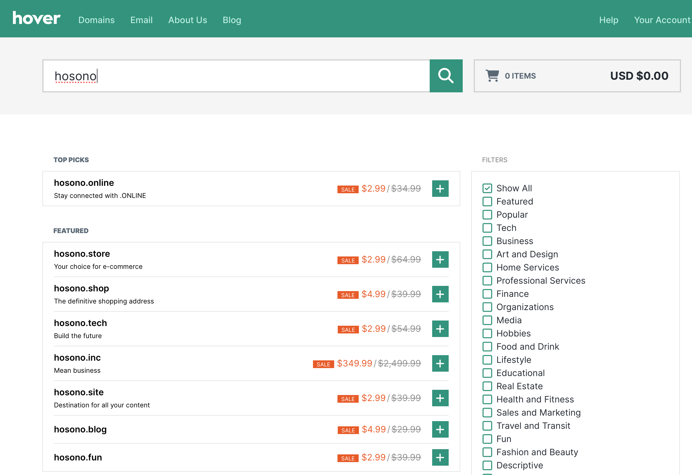

Note: Дээрх аргаас гадна өөр олон арга ашиглан vpn үүсгэх, тохируулах боломжтой.
### Domain худалдан авах
Энэ удаа hover.com-с domain аван тохируулга хийнэ. Нэвтрэн ороод авах гэж domain нэрээр хайлт хийнэ. Гарч ирсэн утгуудаас сонголт хийн худалдан авна. Domain, нэг жилдээ хямдхан, дараа жилээс үнэ нь 10 хэд дахин өсдөг тул сунгалт хийхэд үнийн өсөлт бага байхаар худалдан авалт хийгээрэй.

`hosono.space` нэртэй domain худалдан авлаа.
#### Domain DNS
hosono.space domain-н тохироо дах DNS хэсэгт доорх байдлаар тохируулга хийнэ:


| TYPE  | HOST | VALUE                                | TTL        | ADDED BY |
| ----- | ---- | ------------------------------------ | ---------- | -------- |
| A     | *    | 216.40.34.41                         | 15 Minutes | Hover    |
| A     | @    | 216.40.34.41                         | 15 Minutes | Hover    |
| MX    | @    | 10 mx.hover.com.cust.hostedemail.com | 15 Minutes | Hover    |
| CNAME | mail | mail.hover.com.cust.hostedemail.com  | 15 Minutes | Hover    |

`MX`, `CNAME` тохируулга хийхгүй байж болно.

#### Domain Nameserver
Overview хэсэг дах Nameserver хэсэгт edit хийнэ

`ridge.ns.cloudflare.com`, `tess.ns.cloudflare.com` оруулан save хийнэ.
### Cloudflare-д бүртгүүлэх & тохируулах
#### DNS Records
Cloudflare.com хаягаар орон бүртгэлгүй бол шинээр бүртгүүлнэ. Нэвтрэн ороод Websites хэсгээр орон `Add a site` дээр даран өмнө авсан domain нэрээ оруулаарай. `DNS` цэсээр орон Records бүртгэл хийнэ.


| Type | Name         | Content      | Proxy Status | TLL  |
| ---- | ------------ | ------------ | ------------ | ---- |
| A    | *            | 216.40.34.41 | Proxied      | Auto |
| A    | hosono.space | 216.40.34.41 | Proxied      | Auto |
| A    | www          | 216.40.34.41 | Proxied      | Auto |

#### API Token авах
Overview цэсээс доошлуулаад харвал API гэсэн хэсэг байгаа Get your IP token дээр дарна.


`Edit zone DNS` дэх use template -г сонгоно.

Нэр, Permission, Zone Resources -г доорх зургийн дагуу тохируулаад `Contiune and summary` дарна.

Permissions:
`Zone`, `DNS`, `Edit`
Zone Resources
`Include`, `All Zones`

Create Token дарна:


`gjeuX3Jw8zXCCohha11N9zauX4y02XVx8ZrmY5Nt` token-гоо хуулж аваарай. Бусдад дамжуулах ил газар хуулаад хэрэггүй юм.

Note: Жишээ энэ token-г устгасан болно. 

### Nignx Proxy Manager
#### NPM
NPM суулгах заавартай [энд](https://ca4mi.github.io/posts/2024-01-18-docker-thinkpadr500/) даран дэлгэрүүлэн үзнэ үү. Товчоор бол `docker-compose.yml` дотор жишээ нь:
```yml
version: '2.2' 
services:
  nginxproxymanager:
    image: 'jc21/nginx-proxy-manager:latest' 
    container_name: nginxproxymanager
    restart: unless-stopped 
    ports:
      - '80:80'
      - '81:81'
      - '443:443' 
    volumes:
      - ./nginx/data:/data
      - ./nginx/letsencrypt:/etc/letsencrypt
      # default cred: admin@example.com, changeme
```
суулгаад `localhost:81` -р хандан default creds хандалт хийнэ.

#### Let's Encrypt - Cloudflare
`SSL Certificates` ->  `Add SSL Certificate` -> `Let's Encrypt` сонгоно.


| Талбар                          | Тайлбар                                                                    |
| ------------------------------- | -------------------------------------------------------------------------- |
| Domain Names                    | Эхэнд авсан domain-г бичин оруулна. `*.hosono.space` г.м                   |
| Email Address for Let's Encrypt | Certificates хугацаа дуусах үед мэдэгдэл авах мэйл хаяг бичин тохируулна   |
| Use a DNS Challenge             | Үүнийг чагтлах                                                             |
| DNS Provider                    | Cloudflare -г сонгоно                                                      |
| Credentials File Content        | Cloudflares-с авсан API token-г 1234 гэсэн тоон утгийн оронд солин оруулна |
| Propagation Seconds             | Хоосон орхиж болно                                                         |
| I Agree                         | Үүнийг чагтлах                                                             |

Credentials File Content:
```
dns_cloudflare_api_token = <Cloudflare API token байна>
```

#### Proxy Hosts
Add proxy hosts дээр даран жишээ нь jellyfin-г тохируулж буйг зургаас харна уу. Domain name хэсэгт хандах subdomain бичнэ. Scheme, IP, forward port-ууд тухайн container-н тохиргооноос хамааран өөр байна. Jellyfin-н default port: 8096, docker-compose дотор container name нь jellyfin ба compose нэг network-д тул container name-г хандалт хийж болох юм г.м.


SSL цэсээр орон SSL Certificate талбарт өмнө үүсгэсэн `*.hosono.space` -г сонгоод `force SSL`, `HTTPS Support` сонгон save хийнэ.


Энэ мэтээр proxy hosts тохируулах юм.

### Tailscale & NextDNS
[Tailscale](https://tailscale.com) бүртгэлгүй бол бүртгүүлээд сервер дээрээ [script](https://tailscale.com/kb/1347/installation) ашиглан суулгаад machine бүртгэл хийгээд approve хийсэн бол доорх зураг шиг харагдана.


[NextDNS](https://nextdns.io) бүртгэлгүй бол бүртгүүлээд Endpoints хэсэг дэх ID хуулна. Tailscale-н dashbaord руу буцан ороод DNS цэсээр орон `Add nameserver` дээр даран `NextDNS`-г сонгоно. 


Гарч ирсэн цонхонд NextDNS-н Endpoints хэсэг дэх ID-г оруулан save. Дараа нь `Override local DNS` -г on болгоно.


Үүний дараа NextDNS [тохиргоон](https://my.nextdns.io/) дах Settings хэсэг дах Rewrites-д `New rewrite` оруулна.

Domain талбарт `hosono.space`, Answer хэсэгт tailscale-н machine IP address оруулан save. Save хийсэн бол дараах байдалтай харагдана. 

Tailscale -г on болгоод `https://jellyfin.hosono.space` руу хандан, SSL Cert шалгавал:
