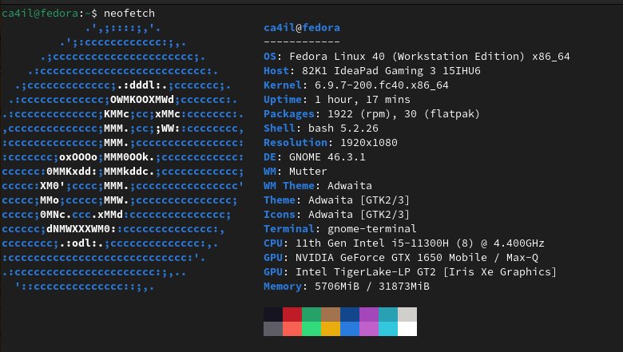

Configuration of Fedora 40

### Cleaning
```bash
sudo dnf remove mediawriter gnome-contacts gnome-weather gnome-maps gnome-boxes gnome-tour gnome-software cheese totem -y
sudo dnf autoremove -y
systemctl disable NetworkManager-wait-online
systemctl mask NetworkManager-wait-online
```

### Configuring
Install flatpak:
```bash
flatpak remote-add --if-not-exists flathub https://dl.flathub.org/repo/flathub.flatpakrepo
```

Install dnf5:
```bash
# Insatall dnf5
sudo ln -sf dnf-3 /usr/bin/dnf
sudo dnf install dnf5
sudo ln -sf dnf5 /usr/bin/dnf
echo "max_parallel_downloads=10" | sudo tee -a /etc/dnf/dnf.conf
sudo dnf5 install 'dnf5-command(config-manager)'
```

Other apps:
```bash
# Nvidia
# https://rpmfusion.org/Howto/NVIDIA

# Multimedia
# https://rpmfusion.org/Howto/Multimedia

sudo dnf install btop                      # https://github.com/aristocratos/btop
sudo dnf install kitty                     # https://sw.kovidgoyal.net/kitty/
sudo dnf install syncthing                 # https://syncthing.net/
sudo dnf install podman                    # https://podman.io/
sudo dnf install podman-compose
sudo dnf install fastfetch

# install VLC Player
sudo dnf install https://download1.rpmfusion.org/free/fedora/rpmfusion-free-release-$(rpm -E %fedora).noarch.rpm
sudo dnf install https://download1.rpmfusion.org/nonfree/fedora/rpmfusion-nonfree-release-$(rpm -E %fedora).noarch.rpm
sudo dnf install vlc
```

### Install Apps
#### VPN

- [Tailscale](https://tailscale.com)
```bash
curl -fsSL https://tailscale.com/install.sh | sh
```

- [Mullvad VPN](https://mullvad.net/en)
```bash
wget https://repository.mullvad.net/rpm/stable/mullvad.repo
sudo dnf config-manager addrepo --from-repofile=mullvad.repo
sudo dnf update --refresh
sudo dnf install mullvad-vpn
```

#### Apps from flatpak

```bash
Name                             Application ID
AnyDesk                          com.anydesk.Anydesk
Discord                          com.discordapp.Discord
Alpaca                           com.jeffser.Alpaca
Thincast Remote Desktop Client   com.thincast.client
Visual Studio Code               com.visualstudio.code
Newsflash                        io.gitlab.news_flash.NewsFlash
Obsidian                         md.obsidian.Obsidian
Mullvad Browser                  net.mullvad.MullvadBrowser
Signal Desktop                   org.signal.Signal
Kdenlive                         org.kde.kdenlive
darktable                        org.darktable.Darktable
Zen                              io.github.zen_browser.zen 
```

### Firefox addons
- [Dark reader](https://addons.mozilla.org/en-US/firefox/addon/darkreader/)
- [Bitwarden](https://addons.mozilla.org/en-US/firefox/addon/bitwarden-password-manager/?utm_source=addons.mozilla.org&utm_medium=referral&utm_content=search)
- [uBlock Origin](https://ublockorigin.com/)

### Keyboard Layout
I've been using Dusal bicheech for a decade now. Really appreciate [Almas](https://github.com/almas) for creating Mongolian qwerty keyboard.
[Dusal bicheech](https://dusal.blogmn.net/10759/):

```bash
git clone https://github.com/almas/Dusal_Bicheech_XKB
cd Dusal_Bicheech_XKB/
chmod +x Dusal_bicheech.sh
./Dusal_bicheech.sh 
```