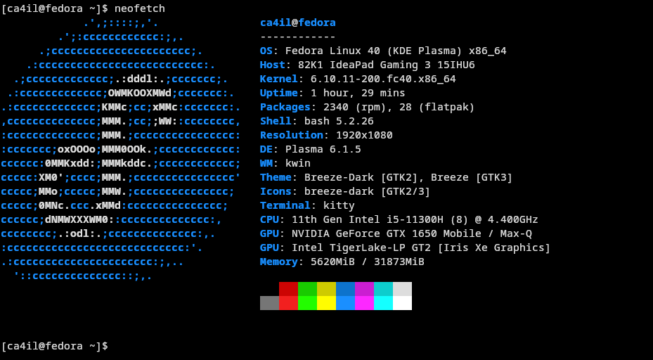
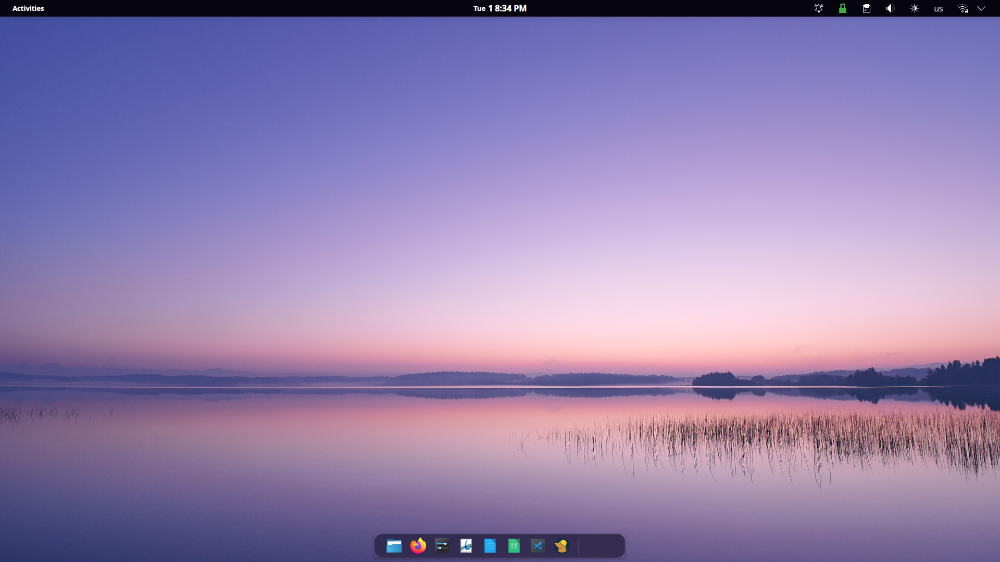

Neofetch:

Fedora 40 KDE Plasma was suggested by a co-worker, and I tried it out. It seems way better than I thought. GPU is stable, X11 environment is clean, and overall it's running smoothly.

Screenshot:


### Setup
#### dnf installs
```bash
# Flatpak repo
flatpak remote-add --if-not-exists flathub https://dl.flathub.org/repo/flathub.flatpakrepo

# Other apps
sudo dnf install btop
sudo dnf install kitty
sudo dnf install syncthing
sudo dnf install fastfetch
sudo dnf install podman-compose

# VPN
## Tailscale
curl -fsSL https://tailscale.com/install.sh | sh
## Mulvad VPN
sudo dnf config-manager --add-repo https://repository.mullvad.net/rpm/stable/mullvad.repo
sudo dnf install mullvad-vpn

# GPU
sudo dnf install https://mirrors.rpmfusion.org/free/fedora/rpmfusion-free-release-$(rpm -E %fedora).noarch.rpm https://mirrors.rpmfusion.org/nonfree/fedora/rpmfusion-nonfree-release-$(rpm -E %fedora).noarch.rpm
sudo dnf install akmod-nvidia
sudo dnf install xorg-x11-drv-nvidia-cuda
```
#### Mongolian qwerty keyboard /Dusal bicheech/
I've been using Dusal bicheech for a decade now. Really appreciate [Almas](https://github.com/almas) for creating Mongolian qwerty keyboard.

```bash
git clone https://github.com/almas/Dusal_Bicheech_XKB
cd Dusal_Bicheech_XKB/
chmod +x Dusal_bicheech.sh
./Dusal_bicheech.sh 
```

#### Flatpak apps
Apps that using daily.
```bash
Name                             Application ID
AnyDesk                          com.anydesk.Anydesk
Discord                          com.discordapp.Discord
Alpaca                           com.jeffser.Alpaca
Thincast Remote Desktop Client   com.thincast.client
Visual Studio Code               com.visualstudio.code
Newsflash                        io.gitlab.news_flash.NewsFlash
Obsidian                         md.obsidian.Obsidian
Mullvad Browser                  net.mullvad.MullvadBrowser
Signal Desktop                   org.signal.Signal
Kdenlive                         org.kde.kdenlive
darktable                        org.darktable.Darktable
Zen                              io.github.zen_browser.zen 
```

Note: Since NewsFlash's latest release was under Gnome 47, so need to run it with `GSK_RENDERER=opengl` from terminal:

```bash
GSK_RENDERER=opengl flatpak run io.gitlab.news_flash.NewsFlash
```

or use a specific environment:

```bash
# copy the desktop entry to your local directory
cp /var/lib/flatpak/exports/share/applications/io.gitlab.news_flash.NewsFlash.desktop ~/.local/share/applications/
# edit the copied desktop file
vi ~/.local/share/applications/io.gitlab.news_flash.NewsFlash.desktop
# find `exec=` and replace with:
Exec=sh -c 'GSK_RENDERER=opengl flatpak run io.gitlab.news_flash.NewsFlash'
# save & exit
```