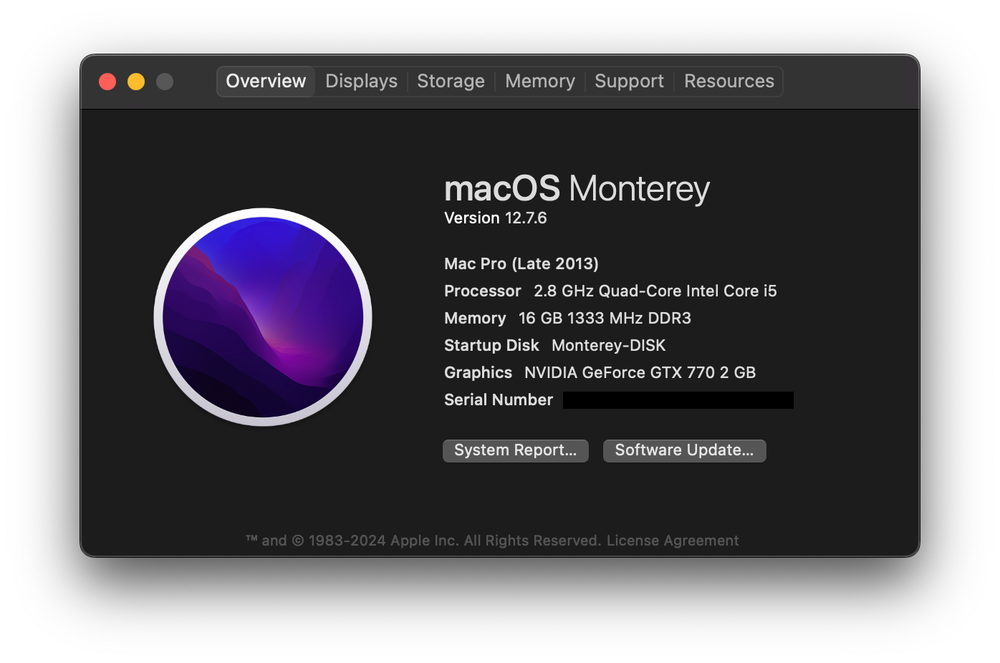

#### OS
You can check my OpenCore config from [here](https://github.com/ca4mi/open-core-config-sandy-bridge)



#### Hardware
- Motherboard: Colorful C.H61U V27
- CPU: Quad Core [Intel Core i5](https://www.intel.com/content/www/us/en/products/sku/52206/intel-core-i52300-processor-6m-cache-up-to-3-10-ghz/specifications.html) | 2.79 GHz | Sandy Bridge
- GPU: ASUS GTX 770 DirectCU II OC 2 GB + kernel patch from [chirs1111](https://github.com/chris1111/Geforce-Kepler-patcher)
- Power Supply: COOLER MASTER|500 Watts| PFC Active MPW-5001-ACABN1
- SSD: Kingston 240 GB | [TRIM](https://en.wikipedia.org/wiki/Trim_(computing)) Enabled via Kernel
- RAM: Envinda DDR3 1600 PCI-12800U-CL9 /only works 1333 MHz/
- Display: Asus PA279CV
- Keyboard & Mouse: Generic

#### Apps
Install Homebrew:

```bash
/bin/bash -c "$(curl -fsSL https://raw.githubusercontent.com/Homebrew/install/HEAD/install.sh)"
```

Brew app list:

```bash
# formula
brew install syncthing

# cask
brew install --cask mullvadvpn
brew install --cask obsidian
brew install --cask kitty
```

Useful brew commands:
```bash
brew search <package_name> # search available packages 
brew update # update homebrew
brew list # list all packages
brew upgrade # upgrade packages
brew autoremove # remove unused dependencies
brew cleanup --prune=all # will cleanup
```

**Other Apps**
* Adobe Photoshop 2024
* Adobe Lightroom Classic
* Capture One 16.3

I'm thinking about upgrading 240GB SSD to a 2TB SSD in the future.