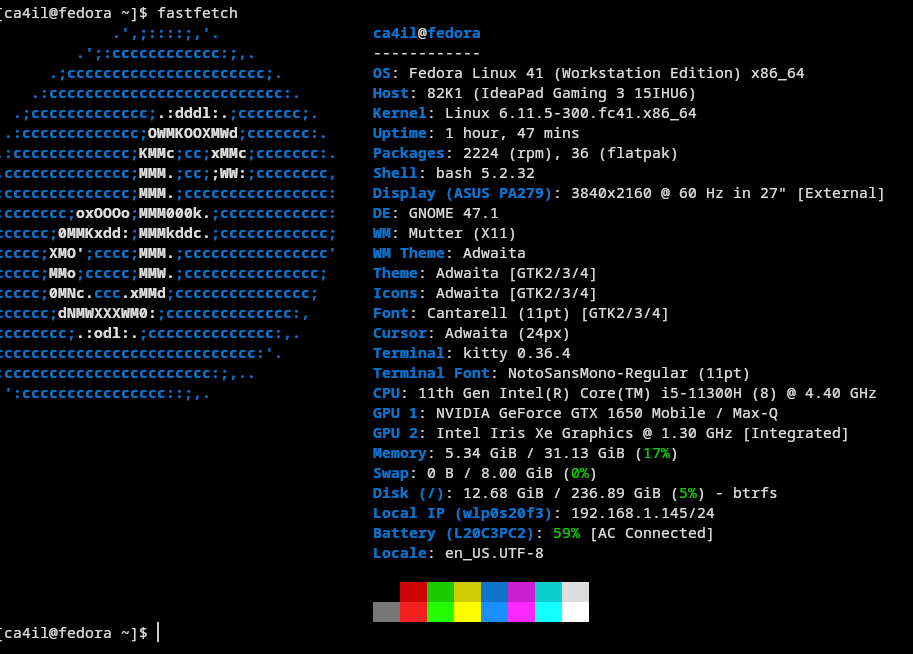

#### Add repos and install apps & drivers
Add repos:
```bash
sudo dnf install https://mirrors.rpmfusion.org/free/fedora/rpmfusion-free-release-$(rpm -E %fedora).noarch.rpm https://mirrors.rpmfusion.org/nonfree/fedora/rpmfusion-nonfree-release-$(rpm -E %fedora).noarch.rpm
```

Install Nvidia driver:
```bash
sudo dnf update -y
sudo dnf install akmod-nvidia
sudo dnf install xorg-x11-drv-nvidia-cuda xorg-x11-drv-nvidia-cuda-libs

# see:
# https://gist.github.com/jacky9813/694a837d93eb0812137665f083e42018
# also can install Multimedia
# https://rpmfusion.org/Howto/Multimedia
```

Wayland to Xorg:
```bash
sudo dnf install @base-x gnome-session-xsession
```

Edit `/etc/gdm/custom.conf`:
```bash
[daemon]
# Uncomment a line to force the login screen to use Xorg
WaylandEnable=false
DefaultSession=gnome-xorg.desktop
```

Install other apps using `dnf`:
```bash
# apps
sudo dnf install btop kitty syncthing podman-compose fastfetch vlc

# Mullvad VPN
wget https://repository.mullvad.net/rpm/stable/mullvad.repo
sudo dnf config-manager addrepo --from-repofile=mullvad.repo
sudo dnf update --refresh
sudo dnf install mullvad-vpn
```

#### Install flatpak
add repo:
```bash
flatpak remote-add --if-not-exists flathub https://dl.flathub.org/repo/flathub.flatpakrepo
flatpak remote-modify --enable flathub

# checking flathub in enable
flatpak remotes
```

install apps:
```bash
flatpak install com.anydesk.Anydesk com.jeffser.Alpaca \
    com.thincast.client com.visualstudio.code io.gitlab.news_flash.NewsFlash \
    md.obsidian.Obsidian net.mullvad.MullvadBrowser \
    org.signal.Signal org.kde.kdenlive org.darktable.Darktable \
    io.github.zen_browser.zen
```

Apps info:
```bash
Name                                   Application ID
AnyDesk                                com.anydesk.Anydesk
Alpaca                                 com.jeffser.Alpaca
Thincast Remote Desktop Client         com.thincast.client
Visual Studio Code                     com.visualstudio.code
Zen                                    io.github.zen_browser.zen
Newsflash                              io.gitlab.news_flash.NewsFlash
Obsidian                               md.obsidian.Obsidian
Mullvad Browser                        net.mullvad.MullvadBrowser
darktable                              org.darktable.Darktable
Kdenlive                               org.kde.kdenlive
Signal Desktop                         org.signal.Signal
```

#### Keyboard layout
Dusal bicheech:
```bash
git clone https://github.com/almas/Dusal_Bicheech_XKB
cd Dusal_Bicheech_XKB/
chmod +x Dusal_bicheech.sh
./Dusal_bicheech.sh 
```

#### Bookmarks
* https://docs.fedoraproject.org/en-US/quick-docs/configuring-xorg-as-default-gnome-session/
* https://gist.github.com/jacky9813/694a837d93eb0812137665f083e42018
* https://discussion.fedoraproject.org/t/cant-install-xorg-on-fedora-workstation-41-beta/133626?replies_to_post_number=2