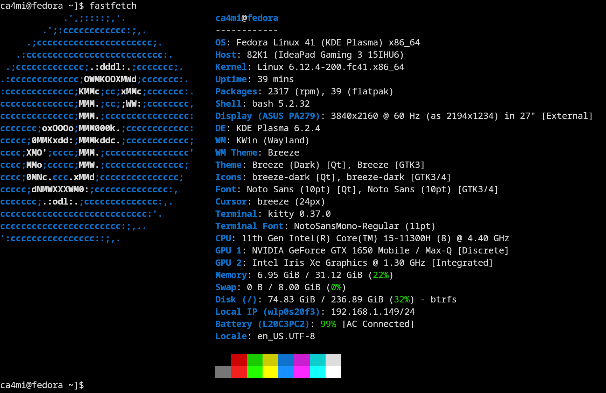

### Fastfetch


### Add repos and install apps & drivers
Add repos:
```bash
sudo dnf install https://mirrors.rpmfusion.org/free/fedora/rpmfusion-free-release-$(rpm -E %fedora).noarch.rpm https://mirrors.rpmfusion.org/nonfree/fedora/rpmfusion-nonfree-release-$(rpm -E %fedora).noarch.rpm
```

Install Nvidia driver:
```bash
sudo dnf update -y
sudo dnf install akmod-nvidia
sudo dnf install xorg-x11-drv-nvidia-cuda xorg-x11-drv-nvidia-cuda-libs

# also you can install Multimedia
# https://rpmfusion.org/Howto/Multimedia
```

Install other apps using `dnf`:
```bash
# Apps
sudo dnf install btop kitty syncthing podman-compose fastfetch vim git git-crypt

# Mullvad VPN
wget https://repository.mullvad.net/rpm/stable/mullvad.repo
sudo dnf config-manager addrepo --from-repofile=mullvad.repo
sudo dnf update --refresh
sudo dnf install mullvad-vpn
```

### Install flatpak & apps
Add repo:
```bash
flatpak remote-add --if-not-exists flathub https://dl.flathub.org/repo/flathub.flatpakrepo
flatpak remote-modify --enable flathub

# checking flathub is enabled
flatpak remotes
```

install apps:
```bash
flatpak install com.anydesk.Anydesk com.jeffser.Alpaca \
    com.thincast.client com.visualstudio.code io.gitlab.news_flash.NewsFlash \
    md.obsidian.Obsidian net.mullvad.MullvadBrowser org.videolan.VLC \
    org.signal.Signal org.kde.kdenlive org.darktable.Darktable \
    io.github.zen_browser.zen com.valvesoftware.Steam com.obsproject.Studio \
```

App info:

| Name                           | Application ID                   |
| ------------------------------ | -------------------------------- |
| darktable                      | org.darktable.Darktable          |
| Kdenlive                       | org.kde.kdenlive                 |
| Signal Desktop                 | org.signal.Signal                |
| VLC                            | org.videolan.VLC                 |
| AnyDesk                        | com.anydesk.Anydesk              |
| Alpaca                         | com.jeffser.Alpaca               |
| Thincast Remote Desktop Client | com.thincast.client              |
| Steam                          | com.valvesoftware.Steam          |
| OBS                            | com.obsproject.Studio            |
| Visual Studio Code             | com.visualstudio.code            |
| Zen                            | io.github.zen_browser.zen        |
| Newsflash                      | io.gitlab.news_flash.NewsFlash   |
| Obsidian                       | md.obsidian.Obsidian             | 
| Mullvad Browser                | net.mullvad.MullvadBrowser       |  

### Keyboard layout
Dusal bicheech:
```bash
git clone https://github.com/almas/Dusal_Bicheech_XKB
cd Dusal_Bicheech_XKB/
chmod +x Dusal_bicheech.sh
./Dusal_bicheech.sh 
```

### Install EnvyControl
In order to play games on external display with Nvidia gpu (dGPU) need to install EnvyControl and widget:
```sh
sudo dnf copr enable sunwire/envycontrol
sudo dnf install python3-envycontrol
# Optimus GPU Switcher
git clone https://github.com/enielrodriguez/optimus-gpu-switcher/tree/main-kde6
kpackagetool6 -t Plasma/Applet -i optimus-gpu-switcher
```
Change mode to 'Nvidia' for gaming. More info: [EnvyControl](https://github.com/bayasdev/envycontrol?tab=readme-ov-file#some-examples), [optimus-gpu-switcher](https://github.com/bayasdev/envycontrol?tab=readme-ov-file)

### Shell script
TL;DR: A shell script to install apps and driver on Fedora 41 KDE Plasma, as instructed in this blog post:
[Shell script](./fedora_41_kde_basics.sh)