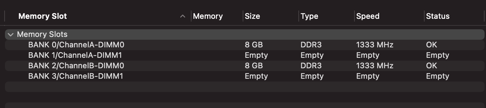

I registered on the site, and they didn’t ask for any personal information such as my first or last name. The only requirement was a phone number. After confirming my number, I created a 4-digit PIN to log in. That was it—just a phone number and a 4-digit PIN to register!

Next, they asked me to choose one of their branch addresses for picking up orders. Before ordering the main item—which costs $90–$100 (ill buy later CPU if this site is trust-able)—I decided to test the service first. I ordered **DDR3 8GB x 2 1600 MHz** RAM for a total of $9 (a cheap option).

Here’s the price breakdown:

| Product                            | Qty | Price              | Total                   |
| ---------------------------------- | --- | ------------------ | ----------------------- |
| DDR3 8GB 1600 MHz                  | 2   | $4.50 / 17,500 MNT | $9.00 / 31,400 MNT      |
| Internal shipping cost in China    | 1   | $2.50 / 9,000 MNT  | $2.50 / 9,000 MNT       |
| Internal shipping cost in Mongolia | 1   | $1.14 / 4,000 MNT  | $1.14 / 4,000 MNT       |
|                                    |     |                    | **$12.64 / 44,400 MNT** | 

After checkout, they generated a QR code for **QPay** (local e-payment or e-wallet system). The payment was successful, but when I checked the transaction, QPay merchant account was an individual’s name, not **Hibox LLC** or any registered company’s bank account.

| date             | desc                        |
| ---------------- | --------------------------- |
| 2024/12/23 17:50 | order confirmed             |
| 2024/12/25 10:33 | YT751****** track enabled |
| 2024/12/30 11:53 | Came in Chinese warehouse   |
| 2025/01/08 17:53 | Came in Hibox branch        | 

After 16 days, item arrived and i installed it my [hackintosh](https://ca4mi.github.io/posts/2024-10-13-hackintosh-setup-apps/)

| Image                                           |
| ----------------------------------------------- |
|  |
|                | 
